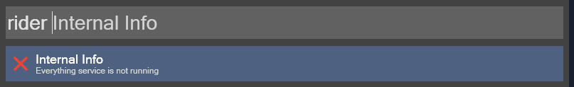

# RiderNavigator
RiderNavigator is a Wox plugin that allows you to quickly navigate to your Rider projects and solutions.  

# Usage 
- `rider` - List all Rider projects and solutions
- `rider <search>` - Filter Rider projects and solutions
- `vs` - List all VisualStudio projects and solutions
- `vs <search>` - Filter VisualStudio projects and solutions
- `vsc` - List all VisualStudioCode projects and solutions
- `vsc <search>` - Filter VisualStudioCode projects and solutions

# Install
`wpm install RiderNavigator`  
`wpm install VisualStudioNavigator`  
`wpm install VisualStudioCodeNavigator`  

Add the installation paths for Rider, Visual Studio, and Visual Studio Code to the environment variable `Path`. If your installation locations differ from the default directories, adjust the paths accordingly.  
Rider: `C:\Users\your user name\AppData\Local\JetBrains\Toolbox\scripts`  
Visual Studio: `C:\Program Files\Microsoft Visual Studio\2022\Community\Common7\IDE`   
Visual Studio Code: `C:\Users\your user name\AppData\Local\Programs\Microsoft VS Code`  

# Troubleshooting
- If you encounter an EverythingException, please check if the Everything service is running. If you haven't installed it yet, you can download it from this [EveryThing](https://www.voidtools.com/).  

# References
- [EveryThingSharp](https://github.com/Riboe/EverythingSharp)