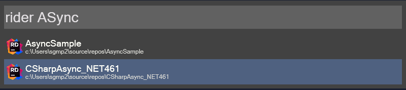
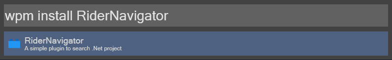

# RiderNavigator
RiderNavigator is a Wox plugin that allows you to quickly navigate to your Rider projects and solutions.  

# Usage 
- `rider` - List all Rider projects and solutions
- `rider <search>` - Filter Rider projects and solutions
- `rider sln <search>` - Open Rider project or solution

# Install
`wpm install RiderNavigator`  

# References
- [EveryThingSharp](https://github.com/Riboe/EverythingSharp)